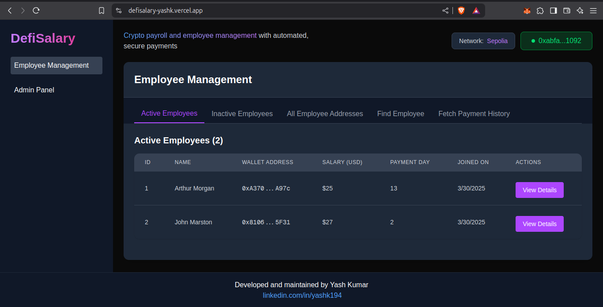
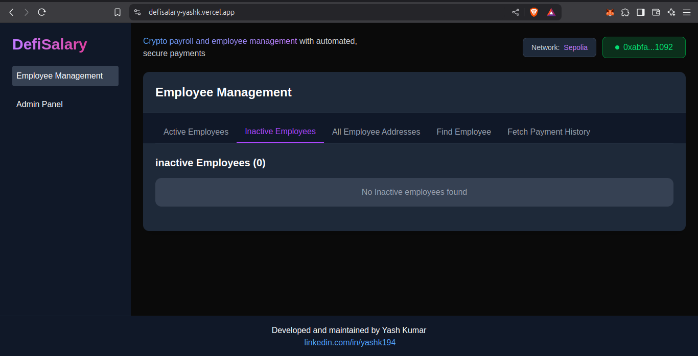
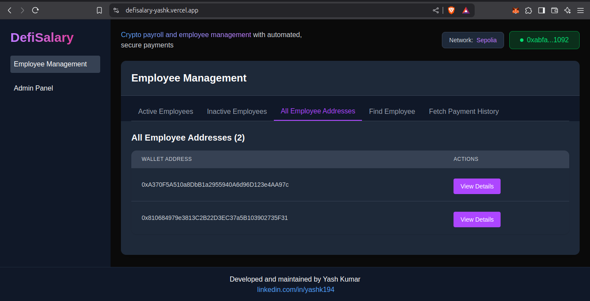
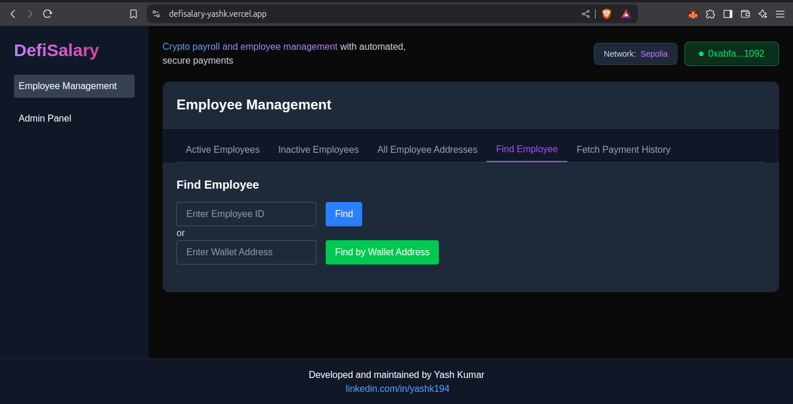
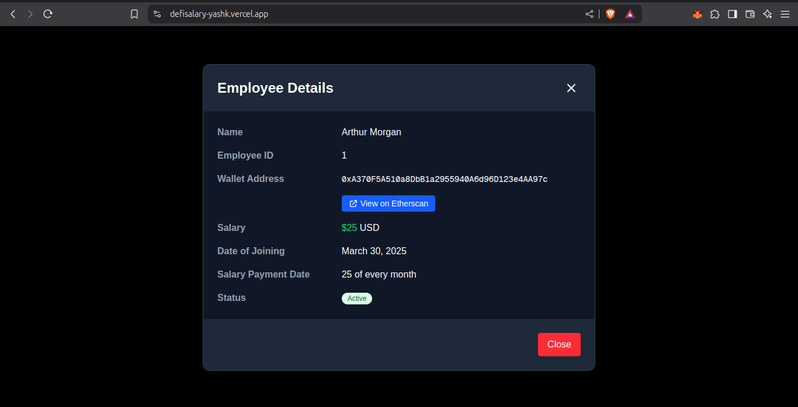
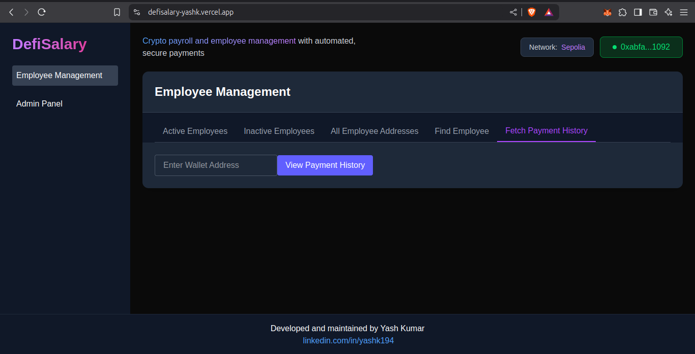

# DeFiSalary

## Overview

DeFiSalary is a decentralized payroll management system that automates salary payments using smart contracts. It enables organizations to efficiently manage employee details, track payments, and ensure timely salary disbursements using blockchain technology.

## Project Domain

- **Live Application:** [https://defisalary-yashk.vercel.app](https://defisalary-yashk.vercel.app/)

## Features

### Employee Management

- Add, remove, and update employee details.
- Employee details include:
  - Name
  - Unique Employee ID
  - Wallet Address
  - Payment Date
  - Joining Date
  - Salary Amount (in USD)
  - Employee Status (Active/Inactive)
- Each employee has a unique employee ID. Old IDs are never reassigned.
- Find employees using their employee ID or wallet address.
- Fetch an employee's payment history.

### Payroll System

- Salaries are automatically paid on the scheduled payment date.
- Admin can update employee details such as name, salary amount, and payment date.
- Salary amount is entered in USD, and the smart contract automatically calculates the equivalent ETH amount based on the latest ETH/USD price.
- Uses **ChainLink Automation** for automated salary payments.

### Admin Dashboard

- View total active and inactive employees.
- Monitor upcoming salary payments.
- Track total USD amount to be paid.
- Display latest ETH/USD price.
- Show contract balance in ETH and USD.
- Fund the contract directly from the platform.

## Smart Contract Implementation

- Uses **AggregatorV3Interface** for fetching the latest ETH/USD conversion rate.
- Integrates **BokkyPooBahsDateTimeLibrary** for gas-efficient date calculations and salary scheduling.
- Ensures only the admin can perform actions like adding, updating, and removing employees.

## Technologies Used

- **Solidity:** Smart contract development
- **Hardhat:** Development and testing framework.
- **Ethers.js:** Blockchain interaction
- **Chai:** For unit testing.
- **Hardhat Ignition:** For deployment automation.
- **ChainLink Automation:** For automated payments
- **ChainLink Data Feeds:** For real-time ETH/USD price conversion
- **BokkyPooBahsDateTimeLibrary:** For efficient date calculations
- **Next.js:** Frontend framework
- **Vercel:** For hosting the frontend application.

## Smart Contract

- **Contract Address (Sepolia):** `0x205Ec9442384AC22eeAaA7C330937Af2fFfB8227`
- **Etherscan Link:** [https://sepolia.etherscan.io/address/0x205Ec9442384AC22eeAaA7C330937Af2fFfB8227](https://sepolia.etherscan.io/address/0x205Ec9442384AC22eeAaA7C330937Af2fFfB8227)

## Project Domain

- **Live Application:** [defisalary-yashk.vercel.app](https://defisalary-yashk.vercel.app/)

## Installation and Setup

### Prerequisites

Ensure you have the following installed:

- Node.js (latest LTS version)
- MetaMask (for interacting with deployed contracts)

### Steps to Run Locally

1. Clone the repository:
   ```sh
   git clone https://github.com/YashK-194/defisalary.git
   cd nft-factory
   ```
2. Check out the respective README files for backend and frontend setup:
   - **Backend README**(backend/README.md)
   - **Frontend README**(frontend/README.md)

## Screenshots

**Homepage**

**Minting NFT**

**After Minting NFT**

**NFT Details**

**Admin Controls**

**NFT in wallet**


## License

This project is licensed under the MIT License.

## Contact

For any inquiries, reach out via GitHub, LinkedIn: [linkedin.com/in/yashk194](https://www.linkedin.com/in/yashk194/) or email at `yashkm194@gmail.com`.
